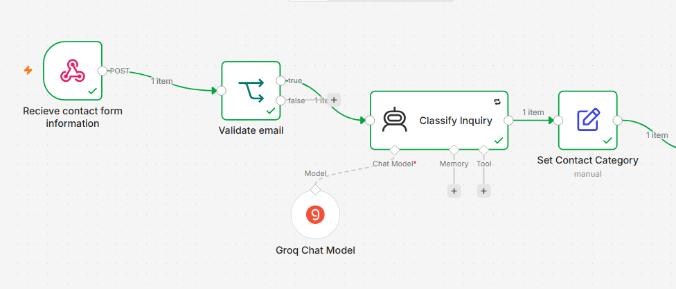
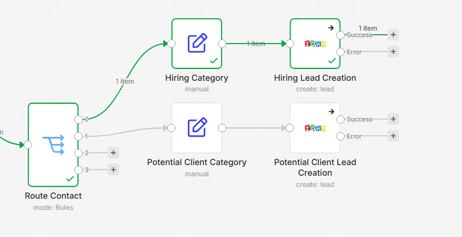

# AI-Powered Website Lead Automation

An n8n automation that processes website contact form submissions, uses AI to classify inquiries, and automatically creates potential client leads in Zoho CRM.

## Overview

This project connects a WordPress Contact Form 7 form with n8n and Zoho CRM.

When a visitor submits the contact form, the workflow receives the submission through an n8n webhook, validates the email address, uses AI to classify the inquiry, and routes the submission based on its category.

Potential client inquiries are prepared as lead data and automatically created in Zoho CRM.

## Problem

Website inquiries can require manual processing:

* Reading every contact form submission
* Identifying whether the inquiry is from a potential client, recruiter, or general visitor
* Copying lead information into a CRM
* Re-entering the same information manually

This automation reduces those repetitive steps.

## Solution

The workflow automates the initial lead-processing process:

1. Receive the website contact form submission.
2. Validate the submitted email address.
3. Use AI to classify the inquiry.
4. Route the inquiry based on its classification.
5. Prepare the lead information.
6. Create a lead in Zoho CRM for potential clients.

### Workflow Components

| Component             | Purpose                                        |
| --------------------- | ---------------------------------------------- |
| **Contact Form 7**    | Collects website visitor inquiries             |
| **n8n Webhook**       | Receives the submitted form data               |
| **Validate Email**    | Checks whether an email address was provided   |
| **AI Classification** | Determines the type of inquiry                 |
| **Route Inquiry**     | Sends the submission to the appropriate branch |
| **Prepare Lead Data** | Formats the information for Zoho CRM           |
| **Zoho CRM**          | Creates a lead for potential clients           |

### AI Classification

The AI classifies incoming inquiries into four categories:

* `potential_client`
* `hiring`
* `general_inquiry`
* `spam`

Potential client inquiries are currently routed to the Zoho CRM lead creation process.

## Technologies Used

* **WordPress** — Website and contact form platform
* **Contact Form 7** — Collects visitor inquiries
* **n8n** — Workflow automation and data processing
* **AI / LLM** — Classifies incoming inquiries
* **Zoho CRM** — Stores potential client leads
* **Webhooks** — Transfers form submission data from WordPress to n8n

## How It Works

### 1. Receive Contact Form Submission

A visitor submits the Contact Form 7 form on the WordPress website.

The form sends the submission to an n8n Webhook.

The received data includes:

{
  "name": "James Largo",
  "email": "example@email.com",
  "subject": "Website Development Inquiry",
  "message": "I would like to discuss a website project."
}

n8n accesses these values from the webhook payload using expressions such as:

$json.body.name
$json.body.email
$json.body.subject
$json.body.message

### 2. Validate Email

The workflow checks whether the submitted email address is present before continuing.

This prevents incomplete submissions from being processed as leads.

### 3. Classify the Inquiry

An AI Agent analyzes the submitted name, subject, and message.

The inquiry is classified into one of four categories:

potential_client
hiring
general_inquiry
spam

The classification result is returned through the AI Agent output.

### 4. Route the Inquiry

A Switch node examines the AI classification and sends the submission to the appropriate branch.

For example:

potential_client
       ↓
Prepare Lead Data
       ↓
Create Zoho Lead

Other inquiry types can be connected to their own actions as the automation is expanded.

### 5. Prepare Lead Data

For potential clients, the workflow prepares the information required by Zoho CRM.

The lead data currently includes:

* Last Name
* Email
* Description
* Lead Source
* Company

The description combines the original subject and message so the inquiry context is retained in Zoho CRM.

### 6. Create the Zoho CRM Lead

The prepared information is sent to Zoho CRM through the Zoho CRM node.

When successful, Zoho returns the newly created lead record, including its Lead ID.

This allows the website inquiry to become a CRM lead without manually copying the information.

## Workflow Screenshot

